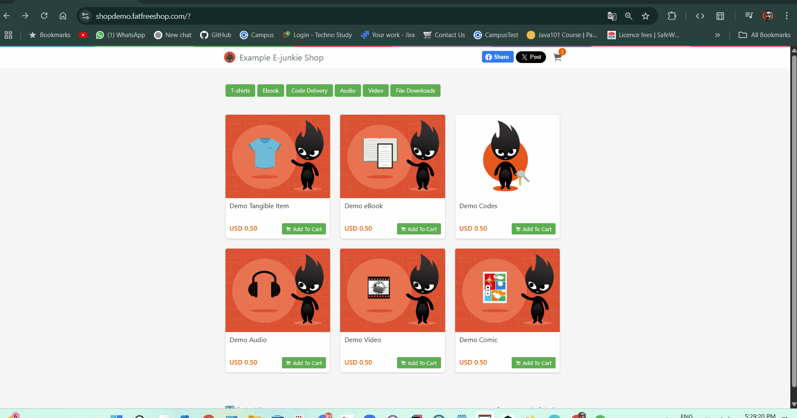
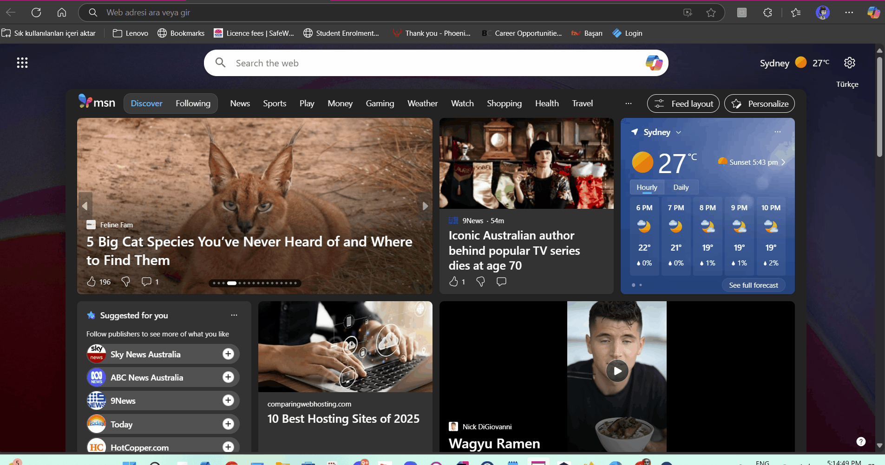

# E-Junkie Test Automation Project – with TestNG 

## 📌 Table of Contents
- [Project Description](#project-description)
- [Project Structure](#project-structure)
- [Project Structure Explanation](#project-structure-explanation)
- [User Stories and Test Scenarios](#user-stories-and-test-scenarios)
- [Test Coverage Table](#test-coverage-table)
- [Tools and Technologies](#tools-and-technologies)
- [Project Team](#project-team)
- [GitHub Repository](#github-repository)
- [Project Team GitHub](#project-team-github)
- [License](#license)

---

## 📝 Project Description

This project was developed to automate test scenarios on the **E-Junkie demo shopping site**.  
The tests are written using **TestNG**, **Selenium WebDriver**, and the **Page Object Model (POM)** structure. 
Tests are executed via the `testng.xml` configuration file.


✅ Features:
- Designed using POM architecture
- Scenario management via `testng.xml`
- Parallel and cross-browser test support

🔗 [E-Junkie Demo Site](https://shopdemo.e-junkie.com/)  
🔗 [E-Junkie Main Page](https://www.e-junkie.com/)

---

## 🏗️🚛  Project Structure

```plaintext
EJunkieProject/
│
├── src/
│   └── eJunkie/
│       │ 
│       ├── base/             # BaseDriver and core structure
│       ├── elements/         # Page Object classes (POM)
│       ├── methods/          # User actions
│       ├── tests/            # TestNG test scenarios
│       │   └─XML/            # TestNG configuration files
│       └── utility/          # Helper classes (MyFunc, etc.)
│
└── README.md                 # Project documentation

```
---
## 📖 Project Structure Explanation
- **src/eJunkie/base/**: Contains the `BaseDriver` class and core structure.
- **src/eJunkie/elements/**: Contains Page Object classes (POM) for each page.
- **src/eJunkie/methods/**: Contains methods for user actions.
- **src/eJunkie/tests/**: Contains TestNG test scenarios.
- **src/eJunkie/tests/XML/**: Contains TestNG configuration files.
- **src/eJunkie/utility/**: Contains helper classes like `MyFunc`, etc.
- **README.md**: Contains project documentation.
---

## 🧑‍💻 User Stories and Test Scenarios

### **1️⃣ US_301 - Add eBook to cart & invalid promo code**
📌 As a customer, I want to add an eBook to the basket and try applying an invalid promo code, so I can check whether the system correctly displays the "Invalid promo code" warning.

✅ Expected: "Invalid promo code" warning message is displayed after clicking “Apply.”

✅ Actual: After adding the eBook to the basket and entering an invalid promo code, the system displayed the warning message "Invalid promo code" upon clicking “Apply.”

### **2️⃣ US_302 - Payment attempt with missing information**
📌 As a customer, I want to attempt payment without entering required fields like email or billing name, so I can confirm that the form validations are triggered.

✅ Expected: "Invalid email" and "Invalid billing name" error messages are displayed.

✅ Actual: When the required fields like email and billing name were left empty, the system triggered the form validations and displayed the error messages "Invalid email" and "Invalid billing name."

### **3️⃣ US_303 - Invalid card number payment attempt**
📌 As a customer, I want to enter a fake card number during payment so I can verify that the system blocks invalid card details.

✅ Expected: "Your card number is invalid" warning appears.

✅ Actual: When a fake card number was entered, the system correctly blocked the payment and displayed the warning message "Your card number is invalid."

### **4️⃣ US_304 - Successful payment with valid card**
📌 As a customer, I want to complete the payment with valid card details so I can receive confirmation of a successful purchase.

✅ Expected: "Your order has been confirmed. Thank you!" is displayed.

✅ Actual: The payment was completed successfully with valid card details, and the message "Your order has been confirmed. Thank you!" was displayed.

### **5️⃣ US_305 - Can user download the eBook?**
📌 As a customer, I want to be able to download the eBook immediately after a successful purchase.

✅ Expected: File download starts and matches the purchased content.

✅ Actual: The eBook download started immediately after the successful purchase and matched the purchased content.

### **6️⃣ US_306 - Submit contact form**
📌 As a customer, I want to send a message through the contact form to get support, and if CAPTCHA is not verified, I should be warned.

✅ Expected: "Recaptcha did not match" error message appears.

✅ Actual: "Recaptcha did not match" error message appeared.



### **7️⃣ US_307 - Access main e-junkie page**
📌 As a customer, I want to navigate from the demo site to the official e-junkie homepage to verify the redirection works correctly.

✅ Expected: Final URL matches e-junkie.com.

✅ Actual: Final URL matched e-junkie.com.



### **8️⃣ US_308 - Access promotional video**
📌 As a customer, I want to play the promotional video and ensure it starts, plays for 10 seconds, and closes properly.

✅ Expected: Video plays and closes after 10 seconds.

✅ Actual: The video started playing successfully, continued for 10 seconds, and closed as expected without any issues.

---

## 📊 **Test Coverage Table**

| Test Scenario                        | Status     | Priority |
|-------------------------------------|------------|----------|
| Invalid Promo Code                  | ✅ Passed  | Medium   |
| Missing Required Fields             | ✅ Passed  | High     |
| Invalid Card                        | ✅ Passed  | High   |
| Valid Payment                       | ✅ Passed  | High     |
| eBook Download                      | ✅ Passed  | High   |
| CAPTCHA Error                       | ✅ Passed  | Medium      |
| Homepage Redirect                   | ✅ Passed  | Low   |
| Video Playback                      | ✅ Passed  | Low      |

---

## 🚀 Tools and Technologies

| Tool / Technology       | Description                            |
|-------------------------|----------------------------------------|
| **Java**                | Programming language                   |
| **Selenium WebDriver**  | Web automation framework               |
| **TestNG**              | Testing framework                      |
| **TestNG XML**          | Manages test configurations and groups |
| **Maven**               | Build and dependency manager           |
| **Page Object Model**   | Reusable and maintainable test design  |
| **Git / GitHub**        | Version control                        |

---
## 📚 Required Libraries

To ensure the project runs correctly, the following libraries must be added to the project:

- Selenium
- TestNG
- Apache Commons IO
- SLF4J NOP

---
## 👨‍💻 Project Team

| Name                | Role                                | User Story     |
|---------------------|--------------------------------------|----------------|
| **Yiğit Çam**        | Project Lead - QA Automation Eng.   | US_301         |
| **Zafer Ataklı**     | QA Automation Engineer              | US_306, US_307 |
| **Rıfat Batır**       | QA Automation Engineer              | US_304,US_305  |
| **Nuri Öztürk**       | QA Automation Engineer              | US_308         |
| **Azim Korkmaz**      | QA Automation Engineer              | US_303         |
| **Mert Can Özdemir**  | QA Automation Engineer              | US_302         |

> Note: This is a collaborative QA training project.

---

## 🔗 GitHub Repository

📂 [E-Junkie TestNG Automation Repository](https://github.com/Yigit-Cam/E-JunkieProject)

---

## 👨‍💻 Project Team GitHub

- **[Zafer Ataklı](https://github.com/zaferatakli)**
- **[Yiğit Çam](https://github.com/Yigit-Cam)**
- **[Rıfat Batır](https://github.com/rftbtr)**
- **[Azim Korkmaz](https://github.com/AzimKorkmaz)**
- **[Nuri Öztürk](https://github.com/NuriOzturk)**
- **[Mert Can Özdemir](https://github.com/lioncarnes)**

---

## 📝 License

This project is licensed under the [MIT License](https://opensource.org/licenses/MIT).
